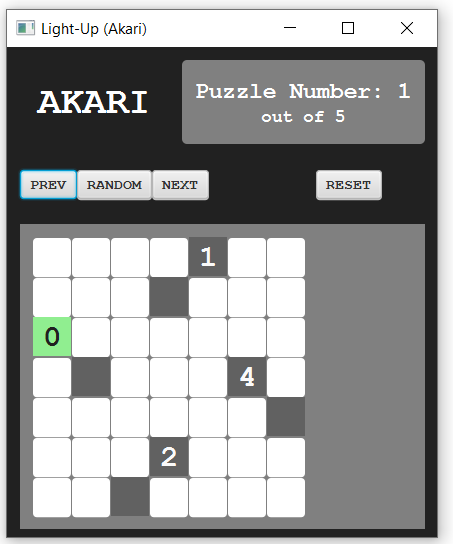
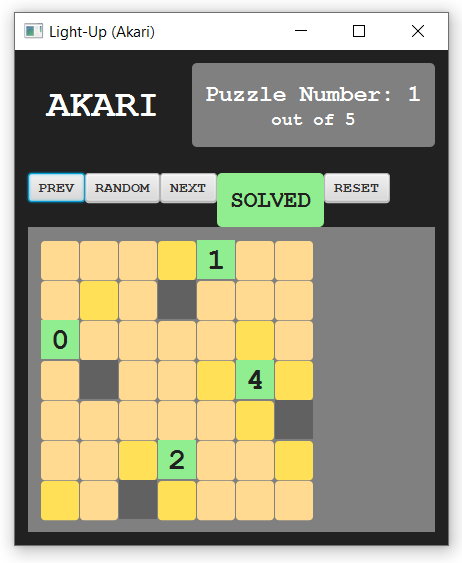

# Light-Up (Akari) Puzzle Game

## Author

[Alex Tang](https://github.com/alex-h-tang)

## Overview
Light-Up (Akari) is an interactive puzzle game based on the popular logic puzzle, Akari. Initially developed as the final project for COMP 301 (Foundations of Programming), I have continued develop on this project, to further showcase my skills in Java, JavaFX, and the Model-View-Controller (MVC) architecture.

## Features

-   **Dynamic Puzzles:** Includes a collection of pre-designed puzzles with varying sizes and difficulties.
    
-   **Interactive UI:** Intuitive interface with real-time feedback on lamp placements.
    
-   **Robust Logic:** Validates illumination, clue satisfaction, and prevents illegal lamp placements.
    
-   **Reset & Win Detection:** Restart puzzles with one click and receive success notifications on completion.
    
-   **Cross-Platform:** Built with JavaFX for compatibility across platforms.
    

## Architecture

Follows the MVC pattern:

-   **Model:** Manages puzzle state, lamp placements, and solution validation.
    
-   **View:** Renders the puzzle grid and user interface using JavaFX.
    
-   **Controller:** Processes user inputs and updates the model and view.
    

## How to Run

### Prerequisites

-   Java 17 or higher
    
-   Maven
    

### Steps

1.  Clone the repository.
    
    ```
    git clone <repository_url>
    ```
    
2.  Navigate to the project directory.
    
    ```
    cd light-up-akari
    ```
    
3.  Use Maven to run the project.
    
    ```
    mvn javafx:run
    ```
    

## Screenshots

### Game Interface


### Mid-game View


### Winning Screen



## Future Enhancements

-   Support for user-created puzzles.
    
-   Additional difficulty levels and themes.
    
-   Persistent storage of puzzle states for users.
    
-   Hint system (beyond the clues) for stuck players.